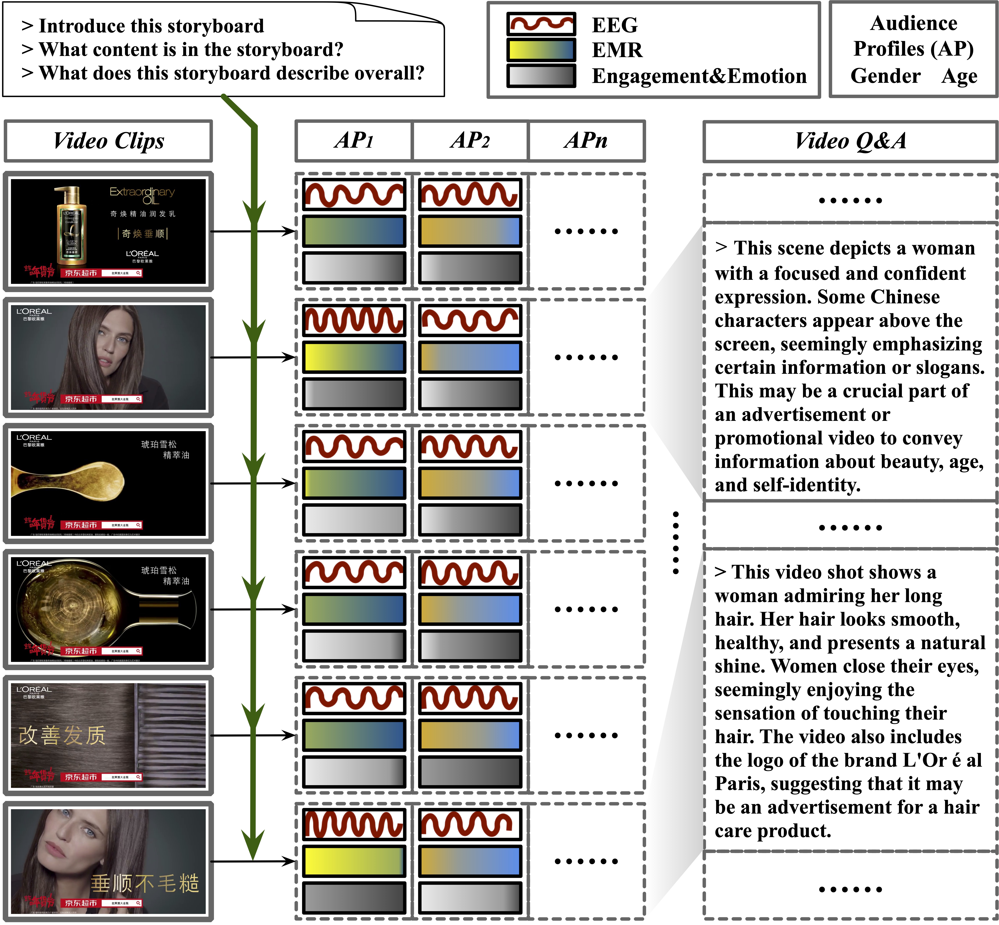
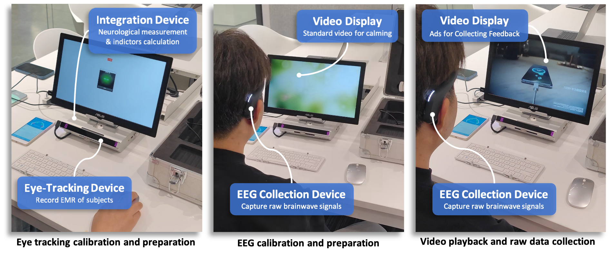

**Dataset Release Coming Soon: Stay Tuned!**

# Video-SME Dataset

## Overview
The Video Subjective Multi-modal Evaluation (**Video-SME**) dataset provides a dual focus on subjective and objective video evaluations, moving beyond conventional video Q&A datasets. It includes a wide array of advertisement videos from diverse industries and uses Subjective Response Indicators (**SRI**) to assess viewer reactions in detail. Collected from a broad demographic in Mainland China, the dataset captures real-time responses with EEG and eye-tracking devices as participants view advertisements.

*Figure: Video-SME dataset pipeline illustrating SRI data collection, video preprocessing, and semi-automated Q&A generation.*

## Key Components

*Figure: Video-SME dataset data collection pipeline.*

### Frame Sequence for Video Representation (FSVR)
**Video-SME** includes 498 high-quality Chinese advertisements spanning industries like food, electronics, and tourism, each with a strong narrative and distinctive visual style. To refine scene segmentation, we employ the Frame Sequence for Video Representation (FSVR) method. With **AdaptiveDetector**, videos are divided into scenes aligned with viewer responses, capturing critical scenes for modality alignment, content comprehension, and Q&A generation.

### Subjective Indicators: SRI Collection and Classification
To capture subjective viewer responses, **EEG signals** and **Eye Movement Ratios (EMR)** are recorded as participants view videos. EEG data provides insights into engagement and emotional states, which we calculate using specific formulas. This data is then synchronized with video scenes, producing time-averaged SRIs aggregated by demographics (e.g., age, gender). SRI data allows for a deeper analysis of audience reactions, enriching model training for subjective assessment.

### Objective Indicators: Semi-automated Q&A Generation
For objective insights, **ChatGPT-4 Vision (GPT4V)** is used to generate Q&A pairs for each advertisement, providing clarity and context. Key frames from FSVR and ASR-generated dialogue enhance comprehension, while human annotators refine answers for accuracy in branding, expressions, and factual details—boosting the dataset’s value in model training.

### Data Overview, Tasks, and Protocols
**Video-SME** includes both subjective and objective tasks. **Subjectivity** tasks focus on classifying SRIs based on video content and user demographics. **Objectivity** tasks include qualitative video analyses to examine viewer perceptions. Detailed task protocols and instructions are available in `../evaluation`. 
