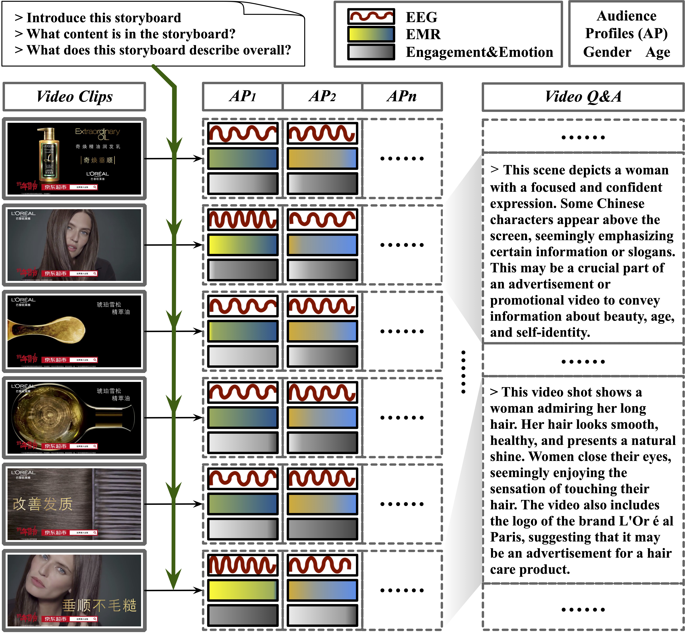
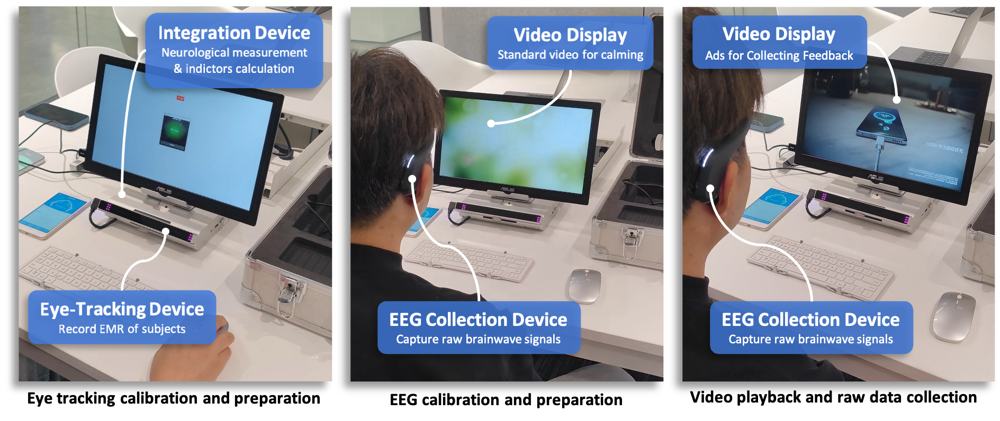

**数据集即将发布：敬请期待！**

# Video-SME 数据集

## 概述
视频主观多模态评估（**Video-SME**）数据集提供了主观和客观视频评估的双重视角，超越了传统的视频问答数据集。该数据集涵盖了多个行业的广告视频，并通过主观反应指标（**SRI**）来深入评估观众的反应。数据来源于中国大陆的广泛受众，使用 EEG 和眼动追踪设备记录观众在观看广告时的实时反应。

*图：Video-SME 数据集的生成流程，展示了 SRI 数据收集、视频预处理和半自动问答生成。*

## 关键组成部分

*图：Video-SME 数据集的数据收集流程。*

### 视频表示的帧序列 (FSVR)
**Video-SME** 包含 498 部高质量的中文广告，涵盖食品、电子产品和旅游等行业，每部广告均具有强烈的叙事性和独特的视觉美感。为优化场景分割过程，我们采用了视频表示的帧序列 (FSVR) 技术。通过 **AdaptiveDetector**，视频被分割为多个场景，以更好地与观众反应保持一致，便于捕捉视频场景的模态对齐、内容理解和问答生成。

### 主观指标：SRI 收集与分类
为捕捉观众的主观反应，我们在观看视频时记录 **EEG 信号**和 **眼动比率（EMR）**。EEG 数据提供了观众的参与度和情绪状态信息，我们通过特定公式计算得到。这些数据与视频场景同步，生成基于时间的 SRI，并根据人口统计特征（如年龄、性别）进行聚合。SRI 数据能够深入分析观众的反应，并为主观分析的模型训练提供支持。

### 客观指标：半自动问答生成
在客观分析方面，我们使用 **ChatGPT-4 Vision（GPT4V）** 生成每个广告的问答对，为视频提供清晰的上下文和理解。结合来自 FSVR 的关键帧和自动语音识别（ASR）生成的对话，我们提升了视频的可理解性。人工标注人员进一步精炼生成的答案，确保品牌、表达和事实的准确性，从而提升数据集在模型训练中的价值。

### 数据概览、任务和协议
**Video-SME** 包含主观和客观任务。**主观性**任务侧重于基于视频内容和用户人口统计特征对 SRI 进行分类。**客观性**任务包括对视频的定性分析，以检查观众的看法。详细的任务协议和说明可以在 `../evaluation` 中找到。
